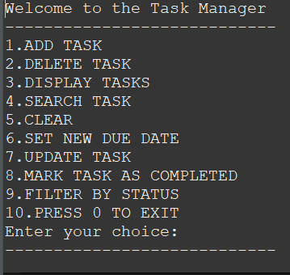
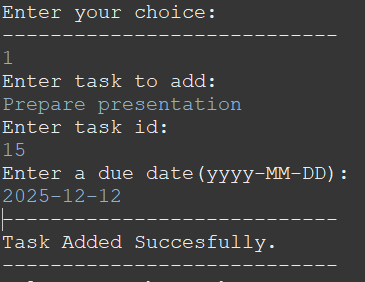
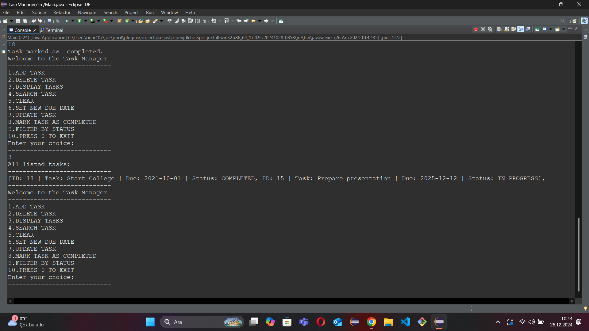
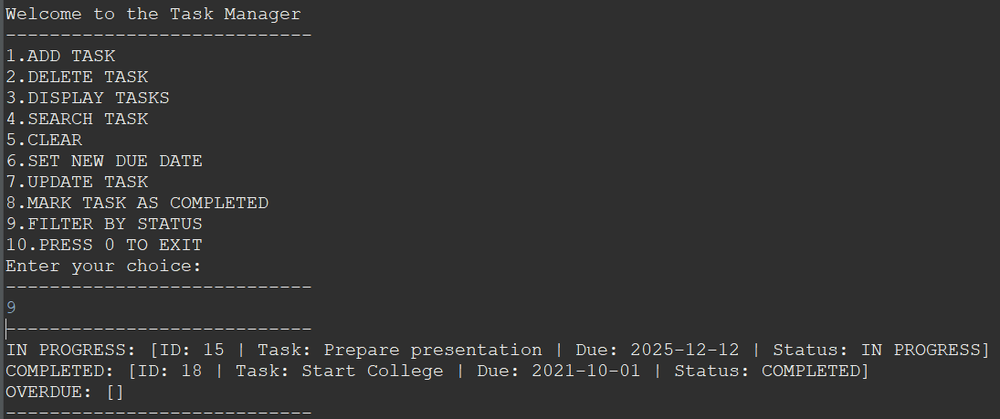
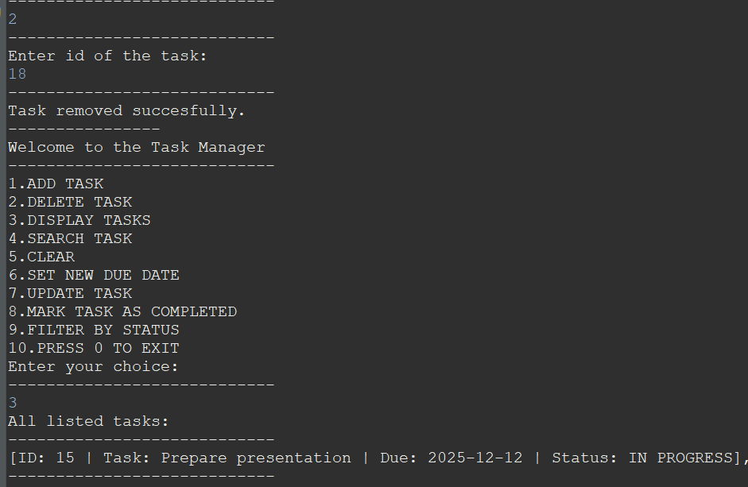

# Console Based Task Manager
- This is a Console Based, Basic Task Manager.

## Features:
- User Friendly Interface

- Can Perform Various Operations Such As Below:
    
     1.Add tasks.
     
     2.Delete tasks.

     3.Displaying tasks ordered by their due date.

     4.Searching through the task list to find task.

     5.Clearing all tasks in the tasks list.

     6.Setting new due date for existing tasks.

     7.Updating existing task(changing the task name).

     8.Marking tasks as completed to keep track of progress.

     9.Filtering task by their status(e.g IN PROGRESS: [ID: 15 | Task: Prepare presentation | Due: 2025-12-12 | Status: IN PROGRESS]).

     10.Exiting Task Manager by pressing '0' .

## How To Run:
1.Clone the repository: `git clone` <https://github.com/Alcom01/Task-Manager-Console-based-.git>

2.Open any IDE that you are comfortable with(Eclipse,IntelliJ,VS Code,etc.)

3.Compile and run `Main` class: `javac Main.java && java Main`

## Tools Used:
- Java(Logic & Programming)
- Console(text-based user interface)

## Screenshots:
### Start Menu

### Add Task

## Display Tasks

## Display Tasks By Their Status

## Delete And Display Tasks

## Future Enhancements:
1.Priority Levels: Allow users to assign priorities (e.g., High, Medium, Low) to tasks and sort the list based on priority.

2.Deadline Alerts:  feature that highlights tasks approaching their due dates to help users manage deadlines better.

3.File Export/Import: Enable users to save their task list to a file and reload it later for persistence between sessions.

  

     
